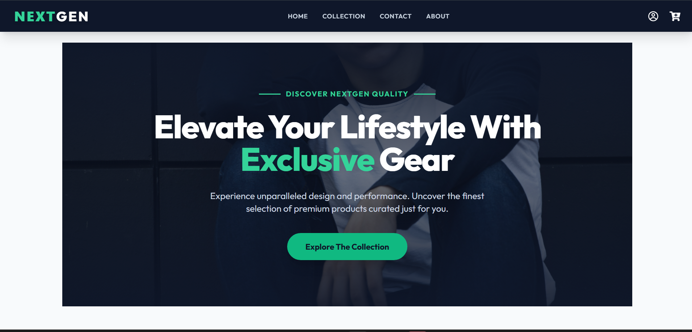
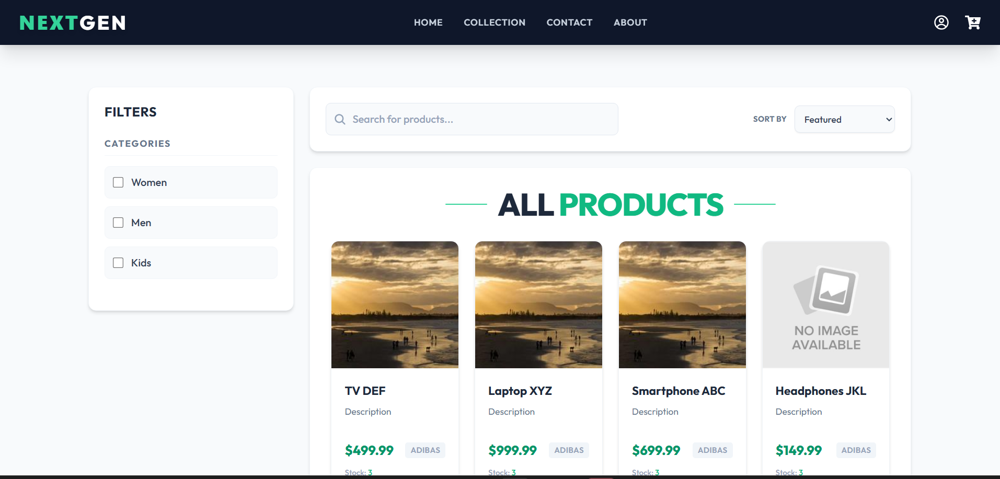
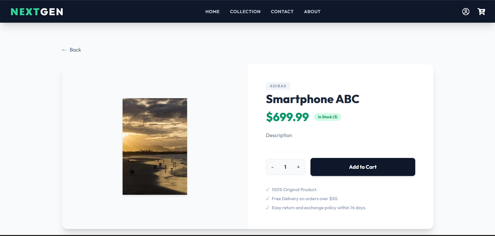
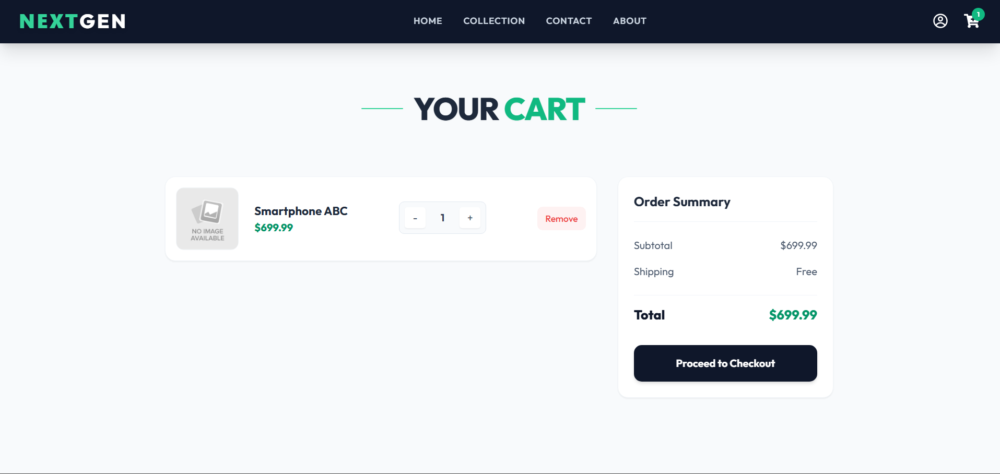
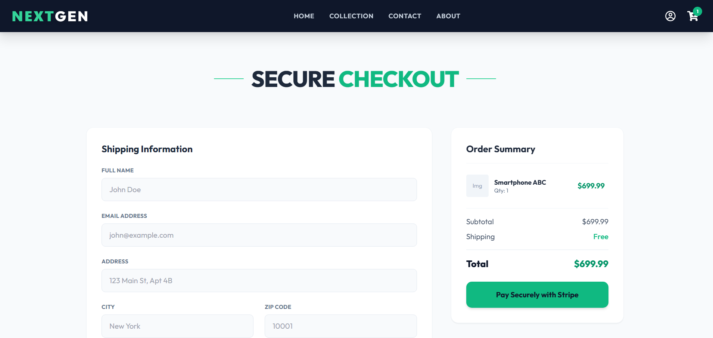
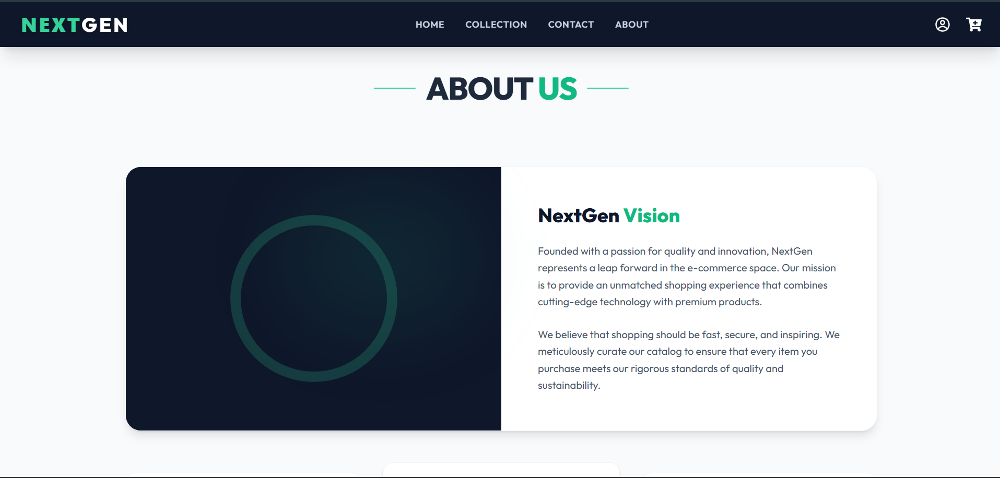
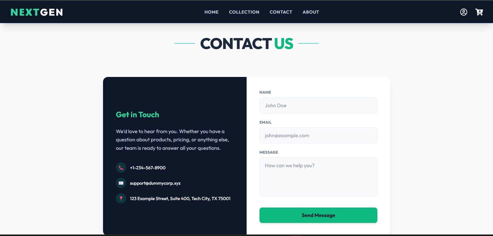
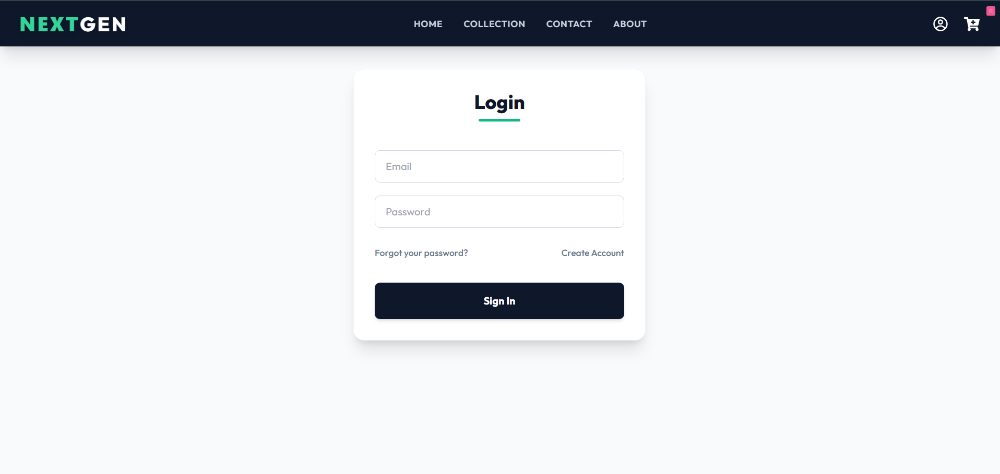
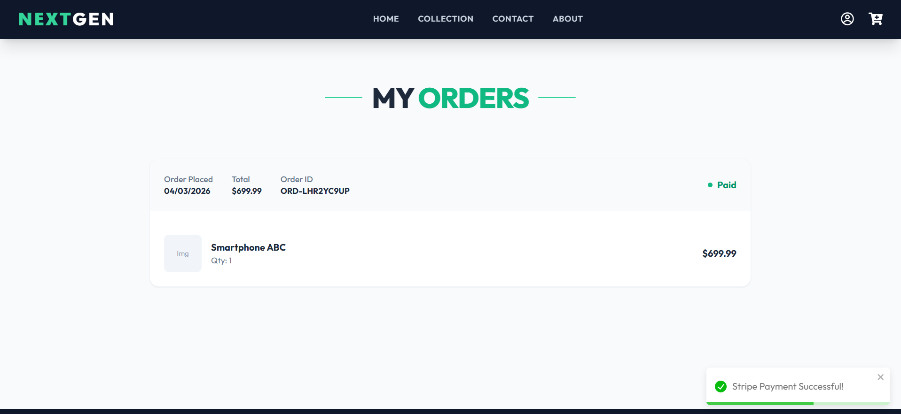

# NextGen E-Commerce Platform

    

A modern, full-stack e-commerce application built with **React, Redux, and TailwindCSS** on the frontend, and **ASP.NET Core 8, Entity Framework, and PostgreSQL** on the backend using CLEAN Architecture.

## Interface Previews
Below is a visual walk-through of the main platform. 

  

  

  

  

  

  

  

  

## Features
- **Users:** Registration, login, profile management, and role-based access.
- **Products & Orders:** Browse catalog, add to cart, checkout, and track orders.
- **Admin:** Complete CRUD capabilities for product management.

## Quick Start

### 1. Prerequisites
- [.NET 8 SDK](https://dotnet.microsoft.com/en-us/download/dotnet/8.0)
- [PostgreSQL / pgAdmin](https://www.pgadmin.org/download/)
- [Node.js 18+](https://nodejs.org/)

### 2. Backend Setup
1. Open terminal in ackend/Ecommerce.Infrastructure.
2. Create an ppsettings.json file with your config:
   \\\json
   {
     "ConnectionStrings": {
       "localhost": "Host=localhost;Database=nextgen_db;Username=postgres;Password=yourpassword;"
     },
     "Jwt": {
       "Key": "SuperSecretKeyForDevelopmentOnly123!!!",
       "Issuer": "NextGen",
       "Audience": "http://localhost:5096/"
     }
   }
   \\\
3. Run migrations and start the server:
   \\\sh
   dotnet ef database update
   dotnet run
   \\\

### 3. Frontend Setup
1. Open a new terminal in rontend.
2. Install dependencies & start:
   \\\sh
   npm install
   npm run dev
   \\\

*UI is now running at http://localhost:5173 and API at http://localhost:5096!*
